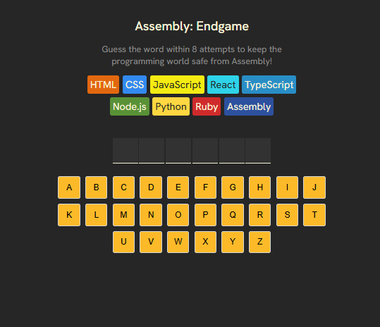

# 🧩 Assembly: Endgame

**Assembly: Endgame** is a fun, word guessing game.  
Your mission: guess the correct word within 8 attempts to save the programming world from Assembly!

## 🎮 How to Play

- You get **8 attempts** to guess a hidden random word.
- Click on the alphabet buttons to guess letters.
- If you guess wrong too many times, Assembly wins!

## 🚀 Features

- Programming-themed word bank (HTML, CSS, JavaScript, Python, etc.)
- Visual letter grid and keyboard interface
- Simple and clean UI
- Built with React + Vite for fast performance
- Easy to expand with new words or languages

## 🛠️ Tech Stack

- [React](https://reactjs.org/)
- [Vite](https://vitejs.dev/)
- JavaScript
- CSS

## 📁 Project Structure

assembly-game/
├── components/ # UI components
├── App.jsx # Main app logic
├── index.jsx # App entry point
├── index.css # Global styles
├── index.html # Template HTML
├── languages.js # Language data
├── utils.js # Game logic/utilities
├── words.js # Word bank
├── vite.config.js # Vite configuration
└── .gitignore # Git exclusions

## Acknowledgments

- Inspired by classic hangman and word games
- Thanks to [Scrimba](scrimba.com) through facilitator, Bob Ziroll
